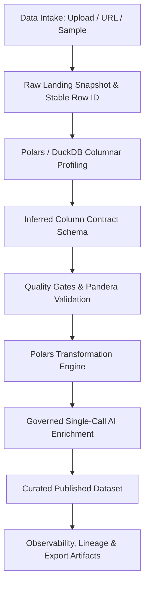

# Enterprise ETL Pipeline Studio

[](https://github.com/Ali-datasmith/enterprise-etl-pipeline-studio/actions/workflows/ci.yml)
[](https://github.com/Ali-datasmith/enterprise-etl-pipeline-studio/actions/workflows/codeql.yml)
[](https://www.python.org/)
[](https://streamlit.io/)
[](https://pypi.org/project/google-genai/)
[](https://github.com/astral-sh/ruff)
[](https://mypy-lang.org/)
[](LICENSE)

*Canonical Repository Slug:* `Ali-datasmith/enterprise-etl-pipeline-studio` (Replace slug in URLs if hosting under a different owner/name).

---

## Executive Summary

**Enterprise ETL Pipeline Studio** is a deployable, Streamlit-based enterprise data platform designed for tabular ingestion, columnar profiling, data contract enforcement, deterministic quality gates, transformation pipelines, governed Google Gemini AI enrichment, and publishable artifacts with lineage observability.

Built for seamless deployment to **Streamlit Community Cloud**, it enforces zero mandatory external dependencies, single-call structured AI inference, state-driven UI rendering, and strict memory safety.

---

## Table of Contents

- [Executive Summary](#executive-summary)
- [Key Features](#key-features)
- [Architecture & Data Flow](#architecture--data-flow)
- [AI Governance & Contract](#ai-governance--contract)
- [Data Quality Framework](#data-quality-framework)
- [Repository Structure](#repository-structure)
- [Installation & Local Run](#installation--local-run)
- [Streamlit Community Cloud Deployment](#streamlit-community-cloud-deployment)
- [Secrets Configuration](#secrets-configuration)
- [Development Quality Commands](#development-quality-commands)
- [Troubleshooting & Limitations](#troubleshooting--limitations)
- [Contributing & Governance](#contributing--governance)
- [License](#license)

---

## Key Features

- **Multi-Format Tabular Intake**: Ingest CSV, JSON, and Parquet from local file uploads, built-in synthetic datasets, or explicit HTTP/HTTPS URL retrieval with SSRF protection.
- **Columnar Profiling Engine**: Profile datasets instantly using Polars and DuckDB aggregate queries. Auto-detect logical types, null distributions, uniqueness, sensitive fields, and geospatial coordinates.
- **Editable Data Contracts**: Infer column contracts and customize rules for nullability, uniqueness, primary keys, and regex/range bounds.
- **Data Quality Gates**: Evaluate data quality with Pandera-backed checks. Quarantine invalid records without silent data deletion.
- **Polars Transformation Pipeline**: Configure ordered transformations (rename, cast, whitespace trim, fill nulls, drop columns, filter) with audit trail logs.
- **Governed Gemini AI Integration**: Leverage Google Gemini via the `google-genai` SDK for single-call structured contract recommendations and record enrichment. Automatic sensitive column redaction prevents raw dataset transmission.
- **Observability & Lineage**: Visualize execution telemetry, stage durations, Plotly Sankey lineage diagrams, and PyDeck geospatial density maps.
- **Exportable Artifacts**: Download published curated datasets in CSV, JSON, or Parquet alongside JSON reports for quality, contracts, and lineage.

---

## Architecture & Data Flow

<!-- Application UI Screenshot Placeholder: Replace with actual screenshot link when available -->



---

## AI Governance & Contract

The AI integration adheres strictly to the single-call structured inference paradigm:

1. **Exactly One Inference Request**: Exactly one API call is made per AI action. No prompt chaining or multi-turn conversation states.
2. **Native Pydantic Schema Validation**: Responses are constrained via `response_mime_type="application/json"` and validated into Pydantic models (`AIAdvisorReport`, `AIEnrichmentReport`).
3. **Redaction First**: Columns classified as sensitive (SSN, email, address, etc.) are automatically redacted (`[REDACTED]`) before sample payload creation.
4. **No Full Dataset Exposure**: Only sanitized schema metadata or small bounded sample sets (e.g., 10-20 rows) are transmitted.
5. **Graceful Degradation**: If `GOOGLE_API_KEY` is absent, AI features are cleanly disabled while all non-AI ETL pipeline functionality remains fully operational.

---

## Data Quality Framework

Quality checks generate an explainable score (0 to 100) based on weighted penalties:

| Severity | Description | Score Penalty |
| -------- | ----------- | ------------- |
| **Info** | Informational observations | 0 pts |
| **Warning** | Minor non-blocking anomalies | -10 pts |
| **Critical** | Schema violation or key duplicates | -25 pts |

### Gate Policies
- `block_on_failure`: Prevents dataset publication if any critical quality check fails.
- `warn_only`: Logs failures but permits publishing.
- `manual_review`: Requires explicit user confirmation.

---

## Repository Structure

```
enterprise-etl-pipeline-studio/
├── app.py                     # Thin Streamlit entrypoint
├── requirements.txt           # Production dependencies
├── requirements-dev.txt       # Development & testing dependencies
├── pyproject.toml             # Tool configurations (Ruff, Mypy)
├── pytest.ini                 # Pytest configuration
├── Makefile                   # Automation commands
├── README.md                  # Project documentation
├── LICENSE                    # MIT License
├── CHANGELOG.md               # Maintainer changelog
├── CONTRIBUTING.md            # Contribution guidelines
├── CODE_OF_CONDUCT.md         # Community code of conduct
├── SECURITY.md                # Security vulnerability policy
├── .streamlit/
│   └── config.toml            # Streamlit theme & server configuration
├── .github/
│   ├── CODEOWNERS             # Repository ownership
│   ├── dependabot.yml         # Dependency update configuration
│   ├── PULL_REQUEST_TEMPLATE.md
│   ├── ISSUE_TEMPLATE/        # Issue templates
│   └── workflows/             # CI, CodeQL, and Dependency Review
├── docs/                      # Architecture, deployment, ADRs
├── etl/                       # Core ETL processing engine
├── ai/                        # Governed Google Gemini AI engine
├── ui/                        # State-driven Streamlit UI modules
└── tests/                     # Deterministic test suite
```

---

## Installation & Local Run

### Prerequisites
- Python 3.10, 3.11, or 3.12

### Setup

```bash
# Clone the repository
git clone https://github.com/Ali-datasmith/enterprise-etl-pipeline-studio.git
cd enterprise-etl-pipeline-studio

# Create virtual environment
python3 -m venv .venv
source .venv/bin/activate

# Install dependencies
make install

# Launch Streamlit application locally
make run
```

---

## Streamlit Community Cloud Deployment

1. Fork or push this repository to GitHub.
2. Sign in to [Streamlit Community Cloud](https://share.streamlit.io/).
3. Click **New app**, select your repository, set branch to `main`, and main file path to `app.py`.
4. Add optional secrets in Streamlit App Settings -> Secrets (see below).
5. Click **Deploy!**

---

## Secrets Configuration

To enable AI features, set the following secret in Streamlit Community Cloud or local environment:

```toml
# .streamlit/secrets.toml
GOOGLE_API_KEY = "AIzaSy..."
GEMINI_MODEL = "gemini-2.5-flash"
```

---

## Development Quality Commands

All quality gates are exposed via the `Makefile`:

| Command | Purpose |
| ------- | ------- |
| `make install` | Install runtime and development dependencies |
| `make run` | Launch Streamlit application |
| `make lint` | Run Ruff check |
| `make format` | Format code with Ruff |
| `make typecheck` | Run Mypy static type checking |
| `make test` | Execute pytest suite with coverage output |
| `make ci` | Execute complete local CI validation suite |
| `make clean` | Clean build artifacts and temporary caches |

---

## Troubleshooting & Limitations

- **Memory Safety**: Streamlit Community Cloud has ephemeral memory limits. Sample mode (100k row limit) is enabled by default for large uploads.
- **Ephemeral Filesystem**: Uploaded data persists only in Streamlit session state and is not saved to server disk.
- **AI Rate Limits**: If Gemini rate limits occur (HTTP 429), the error taxonomy displays an actionable banner without crashing the UI.

---

## License

This project is licensed under the MIT License - see the [LICENSE](LICENSE) file for details.
