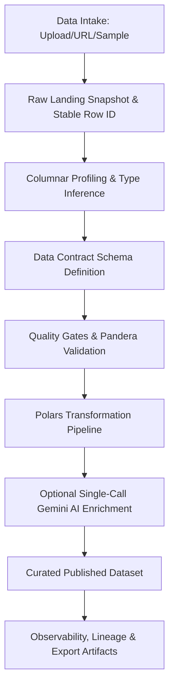

# Enterprise ETL Pipeline Studio - Architecture

## Executive Architecture Summary

Enterprise ETL Pipeline Studio is a governed, schema-first, AI-assisted ETL and data governance application built with Streamlit and Python. It enforces enterprise data platform patterns, deterministic quality gates, and single-call structured AI execution.

## Architectural Planes

1. **Presentation Plane**: State-driven Streamlit tabbed UI with dark minimalist custom CSS.
2. **Application Plane**: Session state orchestration, single-path execution guards, and error taxonomy classification.
3. **Data Plane**: Ingestion, profiling, contracts, validation, transformations, and exports powered by Polars, DuckDB, Pandas, and PyArrow.
4. **Governance Plane**: Data contracts, quality gates, lineage tracking, and AI governance metadata.

## AI Integration Architecture

- **Single-Call Invocations**: Exactly one structured JSON call per AI request.
- **Pydantic Schema Enforced**: Strict validation of AI output into Pydantic models.
- **No Prompt Chaining**: Single turn execution without multi-turn conversation memory.
- **Redaction First**: Automatic field redaction for sensitive columns before AI sampling.
